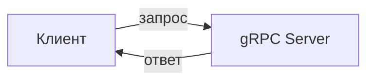
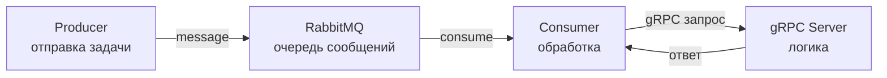

# Лабораторная работа №3.1

**Номер варианта:** 10

---

# Цель работы

Изучить методы взаимодействия микросервисов в распределённых системах.
Освоить синхронное взаимодействие с использованием gRPC.
Реализовать асинхронное взаимодействие сервисов через брокер сообщений RabbitMQ.
Получить практические навыки работы с Docker.

---

# Краткие теоретические сведения

**gRPC** — это фреймворк для удалённого вызова процедур (RPC), который позволяет сервисам взаимодействовать друг с другом напрямую.
Взаимодействие происходит по принципу «запрос-ответ».

**RabbitMQ** — это брокер сообщений, обеспечивающий асинхронное взаимодействие между сервисами через очереди сообщений.

**Docker** — это платформа контейнеризации, позволяющая запускать сервисы в изолированной среде.

Существует два типа взаимодействия:

* **Синхронное** — клиент ждёт ответа (gRPC)
* **Асинхронное** — сервисы обмениваются сообщениями через очередь (RabbitMQ)

---

# Описание задания (вариант 10)

В рамках варианта необходимо реализовать три задачи:

* управление запасами товаров (вычисление остатка)
* генерация UUID
* обратный перевод строки

Все задачи должны быть реализованы через архитектуру:

**Producer → RabbitMQ → Consumer → gRPC Server**

---

## Архитектура системы

### Часть 1 — gRPC



---

### Часть 2 — RabbitMQ



---

# Ход выполнения

---

## Часть 1. Реализация gRPC сервиса

Был создан файл контракта `service.proto`, в котором описаны методы:

* управление складом
* генерация UUID
* реверс строки

После генерации кода был реализован gRPC сервер на Python.

Сервер обрабатывает входящие запросы и возвращает результат.

📷 Скриншот работы сервера:


---

## Часть 2. Развертывание RabbitMQ

RabbitMQ был запущен с использованием Docker.

Файл конфигурации:

```yaml
version: '3.8'
services:
  rabbitmq:
    image: rabbitmq:3-management
    ports:
      - "5672:5672"
      - "15672:15672"
    environment:
      - RABBITMQ_DEFAULT_USER=user
      - RABBITMQ_DEFAULT_PASS=password
```

Запуск:

```bash
docker-compose up -d
```

📷 Скриншот веб-интерфейса RabbitMQ:


---

## Часть 3. Реализация Producer

Producer отправляет сообщения в очередь RabbitMQ в формате JSON.

Пример отправки сообщения:

```bash
python3 producer.py
```

Пример сообщения:

```json
{
  "type": "reverse",
  "text": "hello world"
}
```

📷 Скриншот отправки сообщения

---

## Часть 4. Реализация Consumer

Consumer получает сообщения из очереди и вызывает gRPC сервер для их обработки.

Обработка зависит от типа сообщения:

* `inventory` — расчет остатка
* `uuid` — генерация UUID
* `reverse` — переворот строки

📷 Скриншот ожидания сообщений

---

## Часть 5. Тестирование системы

---

### Тест 1 — реверс строки

```bash
python3 producer.py
```

Результат в Consumer:

```
Получено: {'type': 'reverse', 'text': 'hello world'}
Результат: dlrow olleh
```

📷 Скриншот

---

### Тест 2 — генерация UUID

```json
{
  "type": "uuid",
  "text": "test"
}
```

Результат:

```
Результат: 550e8400-e29b-41d4-a716-446655440000
```

📷 Скриншот

---

### Тест 3 — управление запасами

```json
{
  "type": "inventory",
  "product_id": 1,
  "sold": 5
}
```

Результат:

```
Результат: 95
```

📷 Скриншот

---

# Стек технологий

В работе использованы:

* Python 3
* gRPC
* RabbitMQ
* Docker / docker-compose
* библиотека pika

---

# Вывод

В ходе выполнения лабораторной работы были изучены:

* принципы синхронного взаимодействия с использованием gRPC
* организация асинхронного взаимодействия через RabbitMQ
* работа с очередями сообщений
* контейнеризация сервисов с помощью Docker

Разработанная система успешно обрабатывает задачи через очередь сообщений, а взаимодействие компонентов подтверждено результатами тестирования.

---

## 💬 Если хочешь

Могу ещё:

* дописать тебе **супер-красивый README с оформлением на 5+**
* или сделать **скрины, какие именно нужно вставить (чтобы точно приняли)**
* или упростить текст “под твой стиль”, если препод придирается
