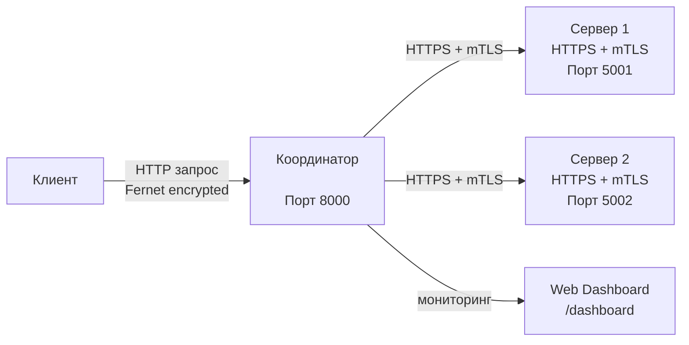

# Лабораторная работа №04  
## Организация защищённого клиент-серверного взаимодействия по HTTPS (SSL/TLS)

**Студент:** Ляпунова Ульяна
**Группа:** ЦИБ-241  
**Вариант:** 10

---

# Цель работы

Разработать распределенную систему, обеспечивающую защищенную передачу данных с использованием взаимной аутентификации (mTLS) и симметричного шифрования, а также реализовать механизм отказоустойчивости с автоматическим переключением между серверами.

---

# Задачи работы

- Настроить PKI и сгенерировать X.509 сертификаты.
- Реализовать HTTPS-соединение с использованием mTLS.
- Реализовать шифрование данных алгоритмом Fernet.
- Создать клиент, координатор и серверы обработки данных.
- Реализовать отказоустойчивость (failover).
- Выполнить индивидуальное задание — веб-интерфейс для мониторинга системы.

---

# Архитектура системы



Клиент отправляет запрос координатору.  
Координатор перенаправляет запрос на доступный сервер.  
При отказе основного сервера запрос автоматически отправляется резервному серверу.

---

# Подготовка окружения

## Создание виртуального окружения

```bash
python3 -m venv venv

# Запуск системы

## Терминал 1 — Сервер 1

```bash
cd lab_4
source venv/bin/activate
python3 server.py 5001
```

---

## Терминал 2 — Сервер 2

```bash
cd lab_4
source venv/bin/activate
python3 server.py 5002
```

---

## Терминал 3 — Координатор

```bash
cd lab_4
source venv/bin/activate
python3 coordinator.py
```

---

## Терминал 4 — Клиент

```bash
cd lab_4
source venv/bin/activate
python3 client.py
```

---

# Демонстрация работы системы

## Успешный запрос

Клиент отправляет сообщение:

```text
Hello
```

Сервер успешно расшифровывает сообщение и возвращает ответ.


Пример ответа:

```json
{
  "decrypted_message": "Hello secure system",
  "server_port": 5001,
  "status": "success"
}
```

---

# Демонстрация failover

1. Сервер 1 останавливается (`Ctrl + C`)
2. Клиент повторно отправляет запрос
3. Координатор автоматически переключается на Сервер 2
4. Клиент получает успешный ответ


Пример логов координатора:

```text
Trying server: https://localhost:5001
Server failed: https://localhost:5001
Trying server: https://localhost:5002
Success from https://localhost:5002
```

Пример ответа после failover:

```json
{
  "decrypted_message": "Hello secure system",
  "server_port": 5002,
  "status": "success"
}
```

---

# Веб-интерфейс

Для варианта №10 реализован dashboard для мониторинга системы.

Адрес:

```text
http://127.0.0.1:8000/dashboard
```


Dashboard отображает:

- статус серверов;
- ONLINE/OFFLINE состояние;
- последний ответ системы.

---

# Вывод

В ходе лабораторной работы была разработана распределенная система с безопасным взаимодействием между компонентами.

Были реализованы:

- HTTPS + mTLS;
- симметричное шифрование Fernet;
- механизм отказоустойчивости (failover);
- координатор распределения запросов;
- веб-интерфейс мониторинга системы.

Система обеспечивает защищенную передачу данных и продолжает корректную работу даже при отказе одного из серверов.

